# ☕ Scape - Coffee Cup Variety Scanner

<div align="center">
  
  <br/>
  <h3>AI-Powered Coffee Cup Identification</h3>
  <p>
    <b>Scape</b> is an intelligent mobile application built with Flutter that uses on-device Machine Learning to identify and classify 10 distinct varieties of coffee cups.
  </p>
</div>

---

## 📱 Application Flow

Experience a seamless journey from detection to discovery.

### 1. Home & Capture
Start by launching the app. You are greeted with a clean interface featuring options to capture a new image via **Camera** or select an existing one from your **Gallery**.

<div align="center">
  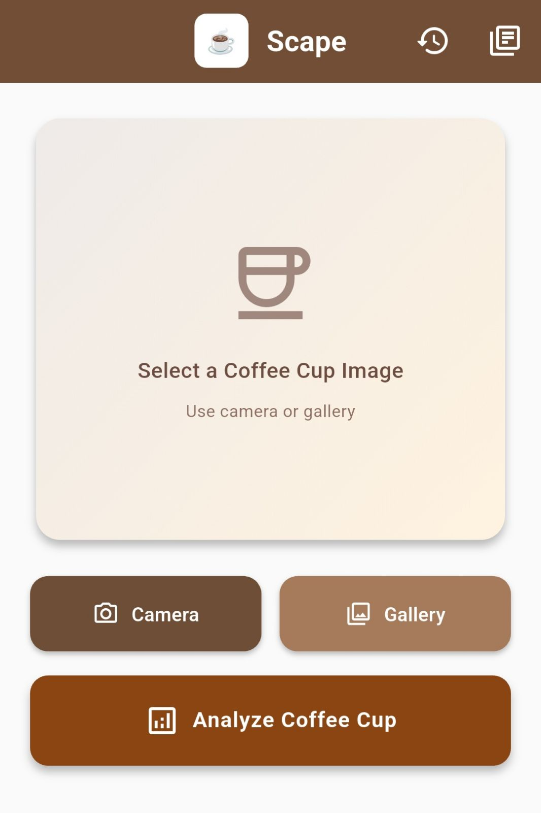
  &nbsp;&nbsp;&nbsp;&nbsp;
</div>

### 2. Analysis & Detection
Once an image is selected, Scape's advanced AI model analyzes the visual characteristics of the cup—looking at shape, texture, and features—to determine its variety.

<div align="center">
  
</div>

### 3. Smart Results
The application displays the **Predicted Class** along with a confidence score.
*   **Prediction Distribution**: View all 10 potential matches with their probability percentages, giving you insight into the model's certainty.
*   **Detailed Info**: Tap on the result to learn more about the specific cup type.

<div align="center">
  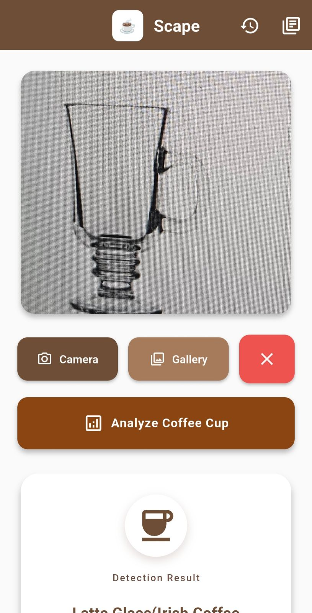  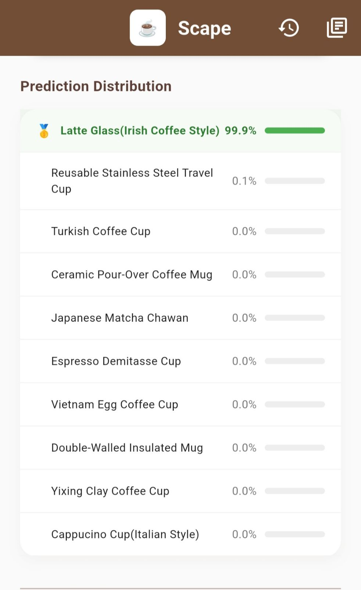
  <br/>
  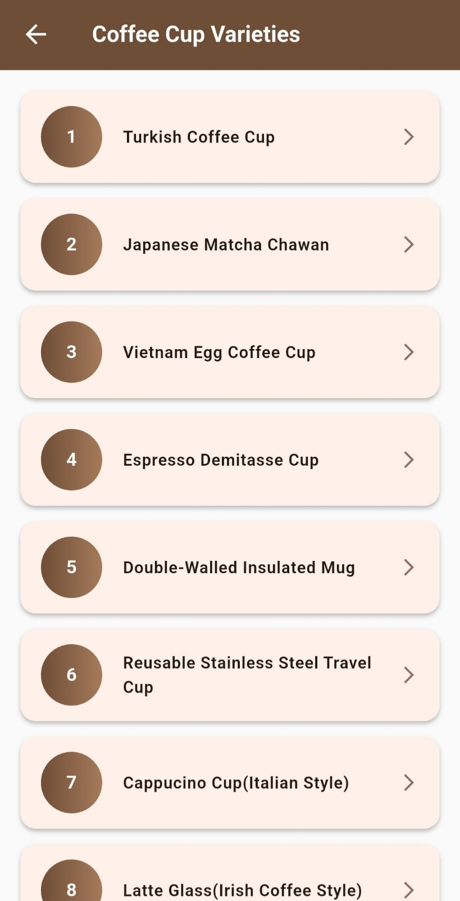 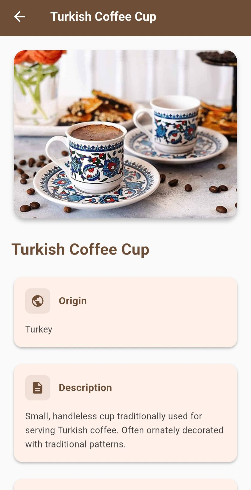 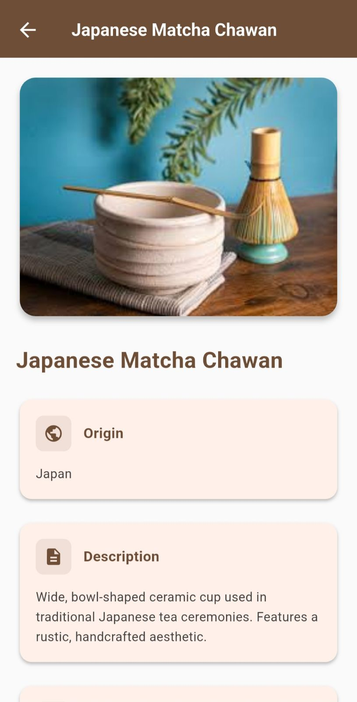
  <br/>
   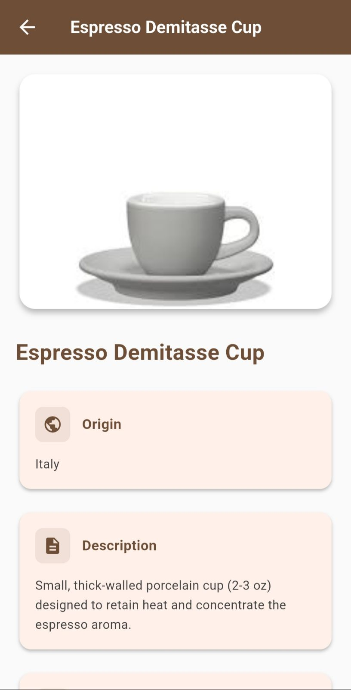 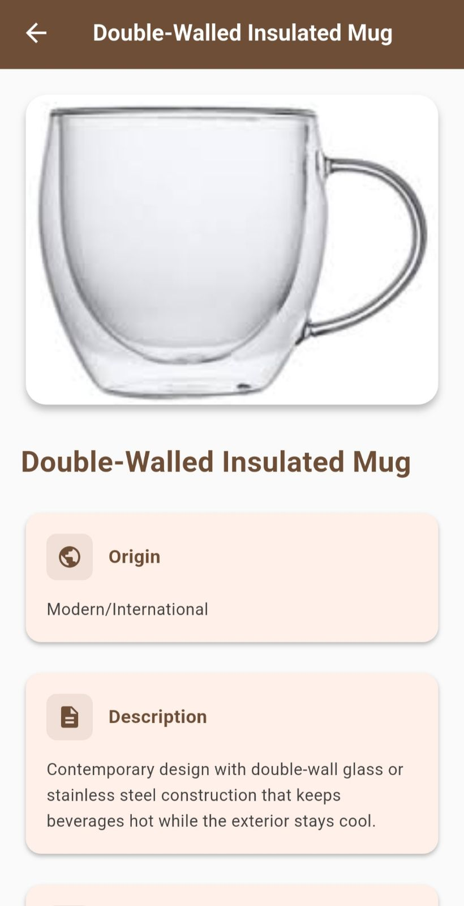
  <br/>
  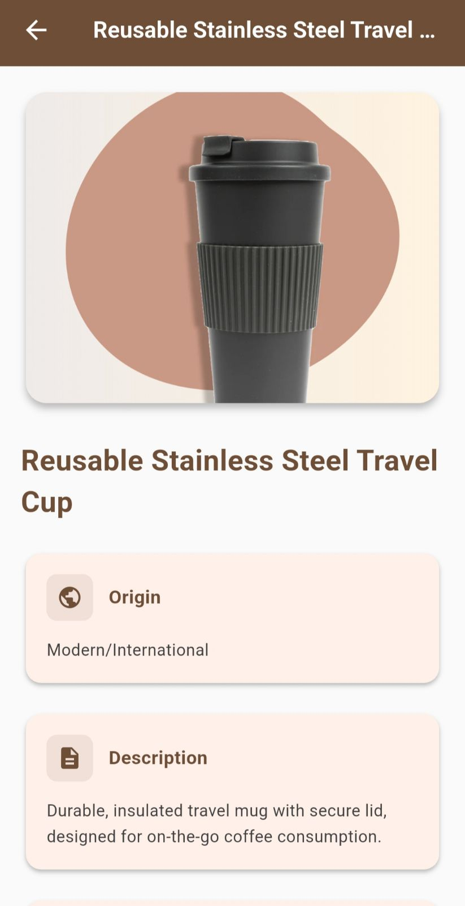 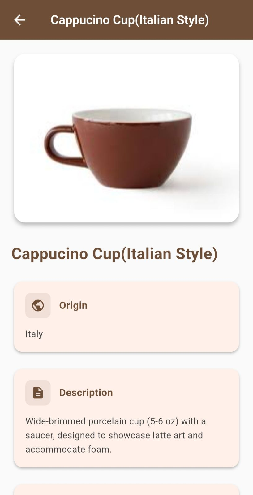 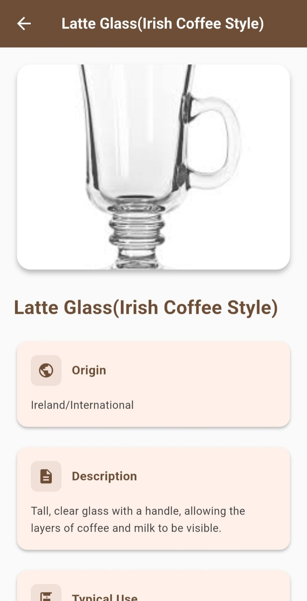
  <br/>
  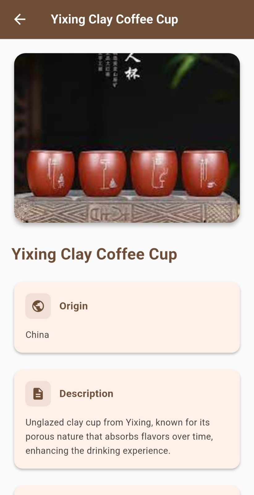  
</div>

### 4. History & Tracking
Keep track of your coffee journey. The **History Page** logs every scan with:
*   **Cup Type**: The identified variety.
*   **Accuracy**: The confidence level of the prediction.
*   **Timestamp**: Exactly when the scan occurred.

<div align="center">
  
  
</div>

---

## 🍵 The 10 Coffee Cup Varieties

Scape is trained to recognize these specific coffee cup types, each with its own unique history and purpose:

| Cup Variety | Description |
|:----------- |:----------- |
| **1. Turkish Coffee Cup** | Small, handleless cup traditionally used for serving Turkish coffee. Often ornately decorated with traditional patterns to enhance the serving experience. |
| **2. Japanese Matcha Chawan** | Wide, bowl-shaped ceramic cup used in traditional Japanese tea ceremonies. Features a rustic, handcrafted aesthetic designed for whisking matcha. |
| **3. Vietnam Egg Coffee Cup** | Small glass cup designed to showcase the distinct layers of Vietnamese egg coffee, highlighting the creamy egg foam topping against the dark coffee. |
| **4. Espresso Demitasse Cup** | Small, thick-walled porcelain cup (2-3 oz) designed to retain heat and concentrate the rich aroma of a single or double shot of espresso. |
| **5. Double-Walled Insulated Mug** | Contemporary design featuring double-wall glass or stainless steel construction that keeps beverages hot for longer while ensuring the exterior stays cool to the touch. |
| **6. Reusable Stainless Steel Travel Cup** | Durable, insulated travel mug with a secure lid, specifically designed for on-the-go coffee consumption and reducing single-use waste. |
| **7. Cappuccino Cup (Italian Style)** | Wide-brimmed porcelain cup (5-6 oz) paired with a saucer. Its shape is engineered to showcase latte art and accommodate the perfect ratio of foam. |
| **8. Latte Glass (Irish Coffee Style)** | Tall, clear glass with a handle, allowing the beautiful layers of steamed milk and coffee to be fully visible and appreciated. |
| **9. Yixing Clay Coffee Cup** | Unglazed clay cup from Yixing, China. Known for its porous nature that absorbs flavors over time, creating a unique patina and enhancing the taste profile. |
| **10. Ceramic Pour-Over Coffee Mug** | Large ceramic mug designed specifically for pour-over coffee brewing, often featuring a wide opening to facilitate optimal extraction. |

---

## 🛠️ Technical Highlights

*   **Framework**: Flutter (Dart)
*   **AI Engine**: TensorFlow Lite (On-device inference)
*   **Backend**: Firebase Realtime Database (History tracking)
*   **Key Features**:
    *   Offline-capable image recognition.
    *   Real-time probability distribution visualization.
    *   Historical data tracking with accuracy metrics.
    *   Educational gallery of coffee cup types.

---

## 🚀 Getting Started

1.  **Clone the repository**:
    ```bash
    git clone https://github.com/yourusername/scape.git
    ```
2.  **Install dependencies**:
    ```bash
    flutter pub get
    ```
3.  **Run the app**:
    ```bash
    flutter run
    ```

---

<div align="center">
  <p><i>Made with ☕ and Flutter</i></p>
</div>
